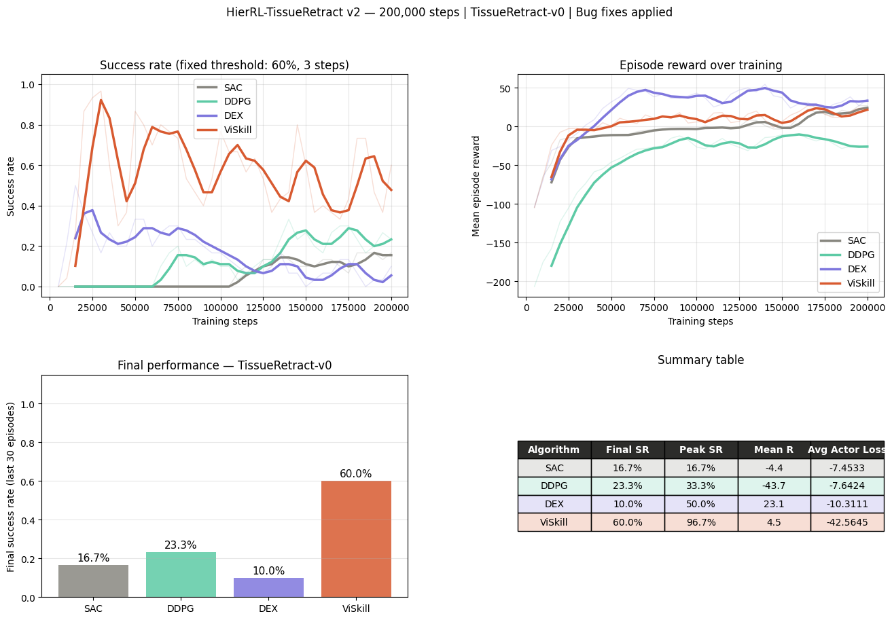
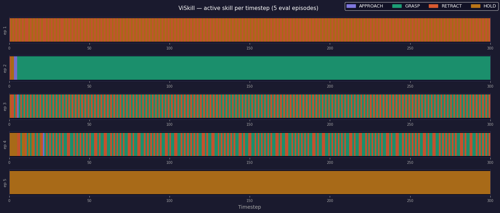

# HierRL-TissueRetract

**Hierarchical Skill Chaining vs. Demonstration-Guided Reinforcement Learning for Surgical Tissue Retraction: A Comparative Study**

Pradeep Surya Dadi — Khoury College of Computer Sciences, Northeastern University
CS 4180/5180 (Reinforcement Learning), Spring 2026 · `dadi.pr@northeastern.edu`

📄 **[Read the paper](paper/hierrl-tissue-retract-aaai.pdf)** · 🖼 [Poster](paper/poster_a0.pdf) · 📓 [Notebook](notebooks/hierrl_v2_final.ipynb) · 📚 [Deep dive](docs/DEEP_DIVE.md)

Autonomous tissue retraction — approach soft tissue, grasp it, lift it to a target
displacement, hold it without tearing — formalised as a continuous-control MDP with a
four-phase internal structure (APPROACH → GRASP → RETRACT → HOLD), and used to compare
four deep RL algorithms on a CPU-only Gymnasium environment with a spring-mass tissue
proxy.



## Results at 200,000 steps

| Algorithm | Final SR | Peak SR | Mean reward | Mean SR |
|---|---|---|---|---|
| SAC | 16.7% | 16.7% | −4.4 | 5.8% |
| DDPG | 23.3% | 33.3% | −43.7 | 12.5% |
| DEX | 10.0% | 50.0% | **+23.1** | 16.0% |
| **ViSkill** | **60.0%** | **96.7%** | +4.5 | **55.6%** |

Success = tissue displacement ≥ 0.6 H\* held for 3 consecutive steps, on a 30-episode
sliding window. Seed 42, single CPU core.

**Hierarchy wins on sustained performance.** ViSkill reaches near-peak by step 25,000 —
roughly 7× faster than SAC's first success at step 110,000 — through gradient isolation:
each sub-policy receives gradients only from its own phase, so a failed RETRACT cannot
corrupt the APPROACH policy.

**Reward and success measure orthogonal things here.** DEX has the *highest* mean reward
(+23.1) and the *lowest* final success (10%); DDPG reaches 23.3% success with mean reward
−43.7, ten times the force penalty of a successful SAC episode. Its Ornstein-Uhlenbeck
noise is double-edged: correlated exploration is what gets the jaw closed, and the same
correlation then produces sustained upward force during RETRACT. On a real robot that
policy would routinely approach the tear threshold. Any single-metric ranking of these
four would mis-order them.

## Closing the generalisation gap

| Variant | Train SR | Eval SR | Gap |
|---|---|---|---|
| ViSkill-SAC (v2, 23D obs) | 60.0% | 10.0% | 50.0 pp |
| ViSkill-DEX (v3, 26D obs) | 80.0% | 30.0% | 50.0 pp |
| **ViSkill-DEX (v3T, tuned)** | 57.0% | **50.0%** | **6.7 pp** |

Eval is 10 held-out seeds (100–109) with the deterministic greedy policy.



The v3→v3T row reads like a regression — training success *drops* 80% → 57% — and is the
opposite. Eval success rises to 50% and the gap collapses to 6.7 pp. The BC floor
(λ_min = 0.15) stops the HOLD sub-policy exploiting training-seed idiosyncrasies, trading
training success for behaviour that stays near demonstrations computed from geometric
primitives invariant to the per-seed anchor pattern. Lowering training peak performance
was the fastest route to eval robustness.

## What the study concludes

1. **Hierarchy is necessary for contact-rich sequential tasks.** 60% vs 10–23% for flat
   baselines isolates *gradient mixing*, not reward sparsity, as the dominant bottleneck.
2. **Demo quality dominates demonstration-guided RL.** Phase-separated demonstrations
   (jaw closes fully before any translation) take the scripted controller from 0% to 96%
   success, and DEX from 3.3% to 50% peak. No hyperparameter change comes close.
3. **Linear BC annealing to zero causes collapse.** DEX peaks at 50% by step 15,000 and
   falls to 10% once λ(t) hits zero at step 80,000. Flooring λ ≥ 0.15 sustains it.
4. **Observation design is algorithmic design.** The 50 pp → 6.7 pp gap reduction came
   primarily from making the observation goal-aware (23D → 26D). No algorithmic change
   alone produced anything comparable — *no algorithm can compensate for information
   missing from the observation.*
5. **Continuous dense rewards beat binary cliff rewards near decision boundaries.**
   Replacing the binary HOLD reward with min(1, d/H\*) removed a zero-gradient region and
   converted 4 of 6 HOLD failures into successes.

## Ablations

| Ablation | Result |
|---|---|
| Naive demos (all dimensions move together) | 0% scripted → DEX 3.3% final |
| Phase-separated demos (jaw first) | 96% scripted → DEX 50% peak |
| ViSkill without the −0.5 GRASP jaw bias | **0%** — permanently stuck in APPROACH |
| ViSkill with jaw bias | 60% final / 96.7% peak |

## Environment

`TissueRetract-v0` — Gymnasium-compatible, CPU-only, no external physics engine.

| | |
|---|---|
| Observation | 23D (v2) / 26D goal-aware (v3, v3T) |
| Action | 4D — Δx, Δy, Δz (±0.05 m), Δjaw (±0.1 rad) |
| Tissue | 4 anchors, Hookean springs, semi-implicit Euler at Δt = 0.01 s |
| Constants | k = 50 N/m, damping 10 N·s/m, m = 0.05 kg, F_lim = 5 N, tear at 2 F_lim |
| Randomisation | grasp target ~ U([−0.05, 0.05]³), target height H\* ~ U([0.15, 0.20]) m |
| Termination | success (3 consecutive steps), tear, or 500-step truncation |

## What this repository reproduces

The notebook is the **v2** experiment: it implements the environment and all four
algorithms, and it is what produces the 200k-step results above. Every constant in the
paper's Table 1 was checked against it — spring constant, force limit, randomised target
height, the 3-step/0.6H\* success condition, the jaw threshold and scale, all four
algorithms' learning rates, batch sizes, buffers and warmups, the 80k BC anneal horizon,
and the −0.5 GRASP jaw bias. Both documented bug fixes are present and commented.

Two things it does **not** contain, and which therefore cannot be re-run from here:

- **The v3 / v3T generalisation study.** The 26D goal-aware observation, the BC floor
  (λ_min = 0.15), the continuous HOLD reward, the ViSkill-DEX sub-agents, and evaluation
  on held-out seeds 100–109 are not in this notebook. The generalisation table above and
  conclusions 3 and 4 come from the paper and are not reproducible from this code yet.
- **Stored results.** The notebook is committed without outputs, so opening it shows code
  only; the figures in `figures/` were extracted from a local executed copy. Reproducing
  the numbers means re-running four algorithms for 200,000 steps each.

One known paper/code discrepancy: the paper specifies anchor jitter ε ~ N(0, 0.02² I),
while the code uses `uniform(-0.02, 0.02)`.

## Contents

```
paper/      the AAAI-format paper and the A0 poster
notebooks/  hierrl_v2_final.ipynb - environment, all four algorithms, experiments
figures/    training dashboard and ViSkill skill timeline
docs/       DEEP_DIVE.md - cell-by-cell walkthrough of every design decision
```

## Relationship to `hierrl_tissue_retract`

The separate [`hierrl_tissue_retract`](https://github.com/pradeepsuryad/hierrl_tissue_retract)
repository is an **earlier prototype and is superseded by this one.** It predates three
environment fixes that are load-bearing for the results above — the success threshold
(0.8 H\* held 10 steps → 0.6 H\* held 3), the spring constant (5 → 50 N/m), and randomised
target height — and it reports near-zero success for every algorithm as a result. Treat
this repository as the reference implementation and those numbers as historical.

## Ethics

Simulation study only. No patient data, no physical robot experiments; tissue dynamics are
a spring-mass proxy. Real deployment would require clinical validation, regulatory
approval, and surgeon-in-the-loop oversight beyond this scope.
